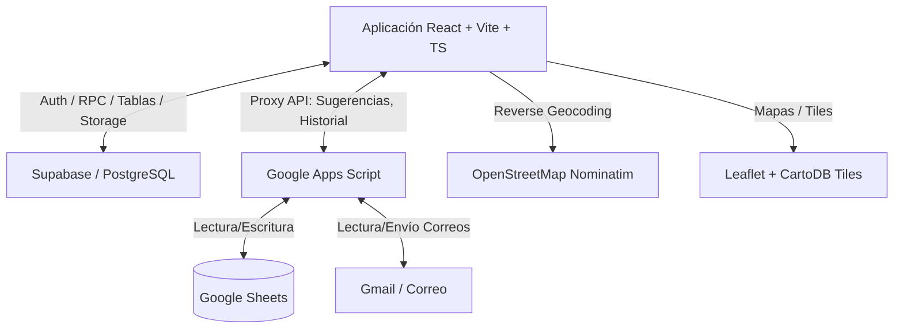

# Arquitectura del Sistema: BaseDatosPagosRH

Este documento detalla la arquitectura del sistema **BaseDatosPagosRH**, diseñado para la gestión de recursos humanos, limpiezas, incidencias, entregas de llaves y pagos de una empresa de gestión de alojamientos turísticos.

---

## 1. Frontend (Cliente React)

El frontend está desarrollado sobre **React 18** utilizando **TypeScript** y compilado mediante **Vite 5**. La interfaz se diseña de manera adaptativa (mobile-first para los trabajadores, desktop-first para la administración) utilizando **TailwindCSS**.

### Estructura de Directorios Clave

- **`src/App.tsx`**: Contiene la definición del enrutador de la aplicación (`react-router-dom`), los guardianes de navegación (`NavigationGuardContext`) y proveedores globales como el tema (`ThemeContext`) y notificaciones flotantes con opción de deshacer (`UndoToastContext`).
- **`src/pages/`**: Contiene las vistas correspondientes a cada ruta de la aplicación.
  - **Vistas del Trabajador**: `WorkerPanel.tsx` (consola móvil principal para el personal), `WorkerAnalytics.tsx`, `WorkerRecords.tsx`.
  - **Vistas Administrativas**: `Dashboard.tsx` (resumen general), `Workers.tsx` (gestión de personal), `Cleans.tsx` (gestión de limpiezas), `Incidencias.tsx` e `IncidenciasDB.tsx` (desperfectos y reparaciones), `EntregaDeLlaves.tsx` y `EntregaDeLlavesDB.tsx` (control de check-ins y cobros de fianza), `Pagos.tsx` (seguimiento de nóminas y saldos), `GestionUsuarios.tsx` (control de accesos admin).
- **`src/components/`**: Componentes visuales y de control organizados por dominios (ej. `layout/`, `ui/`, `chatbot/`, `workers/`, `cleans/`, `accommodations/`).
- **`src/services/`**: Abstracciones de llamadas a APIs externas:
  - `api.ts`: Cliente de Google Apps Script y geocodificación inversa.
  - `supabaseClient.ts`: Inicialización del cliente Supabase.
  - `supabaseOperationsApi.ts`: CRUD administrativo y operaciones de Supabase.
  - `reportsApi.ts`: Cliente para los partes enviados por los trabajadores (servicios, llaves, incidencias, borradores).
  - `pdfExport.ts`: Generación dinámica de reportes en PDF usando `jspdf`.
- **`src/utils/`**: Formateadores de datos, cálculos matemáticos y gestores de borradores de respaldo local (`localDrafts.ts`).

---

## 2. Backend y Persistencia

El sistema utiliza una arquitectura híbrida para la persistencia de datos y lógica de servidor, combinando **Supabase** y **Google Sheets** a través de **Google Apps Script**.

### A. Google Sheets + Google Apps Script (Persistencia Principal de Datos de Gestión)
El núcleo administrativo (personal, limpiezas y logs de incidencias generales) se almacena y actualiza en **Google Sheets** para facilitar a la empresa la lectura de datos de manera directa y visual.
- **Acceso mediante Proxy**: La aplicación React se comunica con Google Sheets a través de una API HTTP expuesta por **Google Apps Script** (`doGet`/`doPost`). Esto evita exponer credenciales directas de las hojas de cálculo en el cliente.
- **Scripts del Servidor (.gs)**:
  - `ENTREGA_LLAVES_APPS_SCRIPT.gs`: Gestiona la hoja `Informe_Entrega_Llaves` de forma transaccional.
  - `SUGERENCIAS_APPS_SCRIPT.gs`: Integración con la API de Gmail para recibir y responder sugerencias y fallos (`FEEDBACK APP`) directamente en una casilla corporativa.
  - `CLEAN_STATUS_APPS_SCRIPT.gs`: Sincronización y lectura de tareas de limpieza de alojamientos.

### B. Supabase (Servicios Core, Seguridad y Estructura en Tiempo Real)
Supabase se utiliza para toda la lógica que requiere control de accesos estricto, gestión de archivos (Storage) y persistencia segura de partes diarios de trabajo.
- **Autenticación**: Registro e inicio de sesión mediante Email/Password o Magic Link.
- **Base de Datos Relacional (PostgreSQL)**:
  - `profiles`: Datos de perfiles de usuario y asignación de roles (`admin`, `editor`, `viewer`, `trabajador`).
  - `workers`: Vinculado opcionalmente a un `profile_id`, contiene tarifas del trabajador por reserva, ropa, hora extra, incidencias y kilómetros, además del saldo pendiente (`pending_balance`).
  - `accommodations`: Listado de alojamientos turísticos y propiedades activas.
  - `worker_accommodations`: Relación N:M de trabajadores asignados a alojamientos específicos, detallando precios de limpieza y ropa de cama por apartamento.
  - `service_reports`: Reportes de servicio (limpiezas de reserva o manitas) rellenados por el personal.
  - `key_deliveries`: Reportes de entregas de llaves (cobros, fianzas, kilómetros, firma del huésped y del trabajador).
  - `incident_reports`: Reportes de incidencias técnicas en el transcurso de un servicio.
  - `report_drafts`: Borradores en la nube para guardar estados intermedios del trabajo de forma segura.
  - `activity_log` e `report_history`: Logs de operaciones y PDFs de informes generados por los administradores.
- **Firma de Documentos (Storage)**:
  - Bucket `signatures`: Almacena firmas electrónicas tomadas en pantalla (como archivos PNG/JPEG públicos de hasta 512KB).
  - Bucket `avatars`: Guarda fotos de perfil del personal.

---

## 3. Integración Geográfica y Mapas

Para la geolocalización (necesaria al registrar check-ins y limpiezas de forma verídica):
1. **Leaflet + OpenStreetMap**: Biblioteca de mapas interactivos que permite al usuario o trabajador arrastrar un pin para fijar una parada o registrar coordenadas geográficas de un apartamento.
2. **Nominatim API**: Geocodificación inversa automática que transforma coordenadas `"lat, lng"` en una dirección legible (calle, número y código postal) para la base de datos de paradas.
